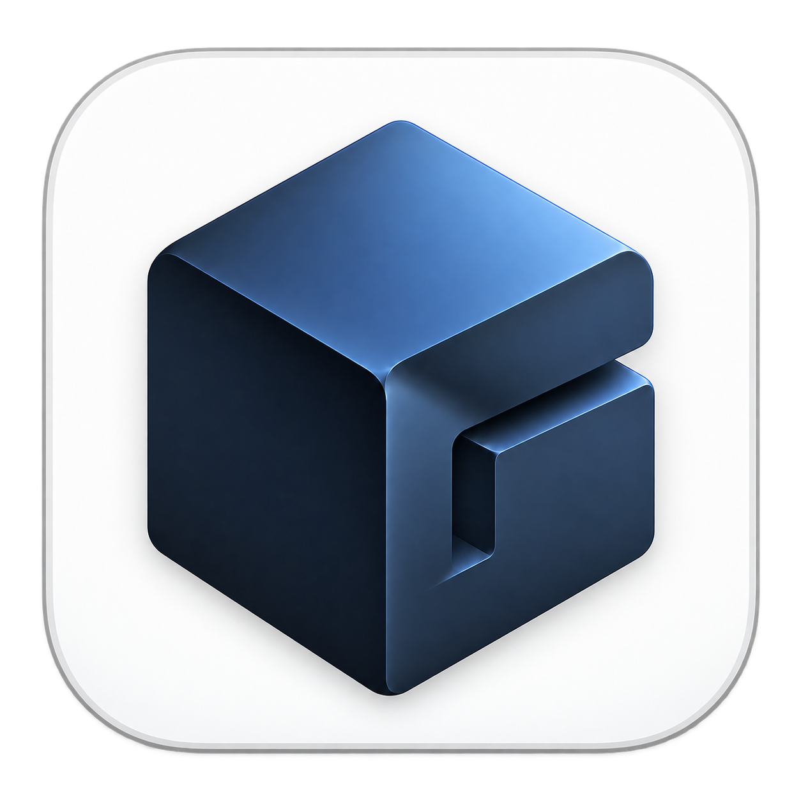

#  Gopher

A local, lightweight, open source LLM harness for humanity.

A more permissive alternative to [Open WebUI](https://github.com/open-webui/open-webui), with:

- OpenAI-compatible and Anthropic Messages–compatible providers, local or cloud
- Chats, projects, Loops (multi-model group chats), memory, model pins, and attachments
- Agent mode with approvals, web search, URL fetching, deep research, browser control, filesystem access, terminal access, and custom skills
- Passphrase-based encryption at rest for chats, preferences, provider credentials, and skills

Gopher does not bundle an inference engine. Connect Ollama, OpenAI, Gemini, Anthropic, or another compatible endpoint.

## Install and run

Gopher is built on your computer from the current **master** commit. Install [current stable Rust with Cargo](https://rustup.rs) and the native build tools for your platform first. The installers compile a pinned commit with the repository’s lockfile, then install the resulting executable. The first build may take several minutes.

### Windows

Install Rust’s **MSVC** toolchain and [Visual Studio Build Tools](https://visualstudio.microsoft.com/downloads/) with **Desktop development with C++** and the Windows SDK. The desktop window also needs [Microsoft Edge WebView2](https://developer.microsoft.com/microsoft-edge/webview2/).

```powershell
irm https://raw.githubusercontent.com/jacobzymet/gopher/master/install.ps1 | iex
```

The script installs to `%LOCALAPPDATA%\gopher\bin` and adds that directory to your user PATH.

### macOS

Install Rust and Xcode Command Line Tools (`xcode-select --install`), then run:

```sh
curl -fsSL https://raw.githubusercontent.com/jacobzymet/gopher/master/install-macos.sh | sh
```

### Linux

Install Rust, a C/C++ compiler, pkg-config, and GLib, GTK3 and WebKitGTK 4.1 development packages. On Debian/Ubuntu:

```sh
sudo apt install build-essential pkg-config libglib2.0-dev libgtk-3-dev libwebkit2gtk-4.1-dev
curl -fsSL https://raw.githubusercontent.com/jacobzymet/gopher/master/install-linux.sh | sh
```

The script prints equivalent Fedora and Arch requirements when dependencies are missing. Unix scripts install to `~/.local/bin`; add it to PATH if needed. Inspect scripts before running them if you prefer. Use `GOPHER_INSTALL_DIR` or `--dir DIRECTORY` to choose the destination; Windows also supports `--no-path`.

### Stay up to date

**App updates track the latest commit on `master`, not new GitHub releases.**

Run `gopher`. **Settings → App** compares this build’s commit with `master` on GitHub. **Build and restart** compiles the current master commit locally with Cargo, verifies the built app’s identity, installs it, and restarts. Build failures leave your installed app intact. Rust and native build tools must remain installed for updates. Compiled dependencies are cached for subsequent builds.

Builds use commit IDs such as `master@0123456789ab`, also shown by `gopher --version`. Modified local checkouts are marked `+modified`; unknown source revisions can be rebuilt from master. Rerunning the platform installer also updates to master. There are no numbered release channels or binary downloads.

To migrate an existing installation that checks numbered releases, install Rust and the build dependencies, then rerun the platform installer above.

To work from a checkout with Git:

```sh
git clone --branch master https://github.com/jacobzymet/gopher
cd gopher
cargo run --locked
# Later, with your local changes committed or otherwise saved:
git switch master
git pull --ff-only origin master
cargo build --release --locked
```

The default launch opens a native desktop window and starts a loopback-only control plane. Updates applied from a Cargo checkout install into the user install folder used by the platform scripts.

| Option | Behavior |
| --- | --- |
| `--browser` | Open the UI in the default browser |
| `--headless` | Run without opening a window or browser |
| `--bind ADDR` | Override the loopback listen address |
| `--config PATH` | Use another `config.toml`; other data is stored beside it |

Default URL: `http://gopher.localhost:3930`. `/settings` redirects to **Settings → Providers**. The optional browser-control tool requires Chrome or Edge.

## Web search

Configure search under **Settings → Agent Capabilities → Web search**:

| Provider | Behavior |
| --- | --- |
| Auto | Uses a configured SearXNG instance first; otherwise DuckDuckGo |
| Parallel | Uses free MCP without a key, or the Search API with a key |
| TinyFish | Uses its Search API and requires a key |
| SearXNG | Uses the configured instance only |
| DuckDuckGo | Uses the HTML and Lite endpoints |

Parallel and TinyFish keys can be entered in Settings or supplied as `PARALLEL_API_KEY` and `TINYFISH_API_KEY`. Result count, recency, region, SafeSearch, and optional result-page fetching are configurable.

## Data and configuration

On-disk data and configuration use the **`gopher`** folder:

| OS | Default directory |
| --- | --- |
| Windows | `%APPDATA%\gopher\` |
| macOS | `~/Library/Application Support/gopher/` |
| Linux | `~/.config/gopher/` |

| Path | Contents |
| --- | --- |
| `config.toml` | Bind, appearance, and unencrypted provider configuration |
| `chats.json` | Conversations and projects |
| `preferences.json` | Settings, model state, and search credentials |
| `provider-tokens.json` | Encrypted provider definitions and credentials; present only when encryption is enabled |
| `encryption.json` | Encryption salt, KDF parameters, and key verifier |
| `encryption-transition.json` | Recovery state used only during encryption-mode changes |
| `chat-skills/skills.json` | Atomic custom-skill snapshot |

Chats, preferences, and skills are encrypted in place when encryption is enabled. Provider configuration is then removed from plaintext `config.toml` and stored in `provider-tokens.json`.

The UI manages these settings, but a minimal configuration is:

```toml
[ui]
host = "127.0.0.1"
port = 3930
theme = "dark" # dark, light, or system

[data]
storage = "disk"

active_provider_id = "…"

[[providers]]
id = "…"
name = "ollama"
base = "http://127.0.0.1:11434/v1"
api_style = "openai" # openai or anthropic
token = ""           # optional for local endpoints
```

Provider API style is detected when a provider is added or saved. Existing entries without `api_style` default to `openai`.

Bind precedence is `--bind`, then `GOPHER_BIND`, then `[ui]`. Network-reachable addresses are refused because the local UI has no authentication.

LLM system and tool prompts live under [`prompts/`](prompts/) and are embedded at compile time.

**Settings → Personalization → Search and reference past chats** is enabled by default, including outside Agent mode. The read-only `list_chats`, `search_chats`, and `read_chat` tools show queries, source links, and expandable retrieved text in activity. Answers can cite original messages; links open the chat and highlight the message. Retrieved text goes to the selected model provider. Project chats retrieve only within their project; non-project chats retrieve only non-project chats in the current profile. Temporary Ghost (incognito) chats cannot retrieve or appear in results and neither read nor update saved memory. Turning the switch off blocks subsequent retrieval, including during an active turn. Saved global/project/bot memory is managed separately. Retrieval uses the existing protected chat store without a plaintext disk index; every call rechecks settings, scope, deletion, and lock state.

Agent file reads run concurrently in groups of up to eight. Writes, commands, browser actions, and their approvals preserve call order. `read_file` defaults to 200 lines and reads bounded pages from large files; use its returned `byte_offset` to continue. `apply_patch` supports multiple files and context hunks, validates the whole patch before writing, and attempts rollback if a commit fails. It preserves unrelated bytes and line endings. External writers are outside the workspace tool lock; rollback leaves detected external edits untouched and reports them.

`run_terminal` returns a session ID when a command continues beyond the initial wait. `wait_terminal` polls that same process or terminates it explicitly. **Settings → Initial wait** controls the first wait (5–30 seconds), not a kill timeout. Sessions are scoped to the conversation and workspace, limited to eight running commands per conversation and 64 sessions overall, and expire after 30 minutes without polling. Captured output stays bounded at 32 KB and retains the beginning and end; larger output is explicitly marked as omitted. The interactive terminal remains separate.

Agent runs budget their context before each model request. Older complete assistant/tool exchanges move into an encrypted temporary archive retrievable through `read_tool_history` during that run; user, system, and developer messages remain intact. The archive uses a per-run key held only in memory and is deleted on close; its limits are 64 MB and 8192 records. If protected input alone is too large, the run reports an error instead of truncating instructions. Text token counts and image costs are estimates, not a provider tokenizer. The context window comes from the selected model's reported metadata when available. Override it with `GOPHER_AGENT_CONTEXT_TOKENS`, or pass `context_window_tokens` in the agent request (highest priority). When none is available, defaults are 8192 tokens without an API key and 32768 with one. Tool schemas and a response reserve are deducted, and individual tool output budgets shrink with the available context.

## Encryption at rest

Enable encryption under **Settings → Local Data**. Gopher derives a 256-bit key with Argon2id (64 MiB, three iterations, one lane) and encrypts protected data with AES-256-GCM using random 96-bit nonces and purpose-bound authenticated data. The passphrase and raw key are never stored; the session key remains in memory until **Lock session** or exit and is then zeroized. Writes use private permissions, atomic replacement, and an exclusive data-directory lock.

The protection covers offline confidentiality and integrity of chats, preferences, provider definitions and credentials, and skills. It does not protect plaintext copies or backups made before encryption, filesystem snapshots, malware or another process in the logged-in session, rollback to an older complete encrypted data set, memory forensics while unlocked, forgotten passphrases, or hardware failure. Secure deletion cannot be guaranteed on SSDs or copy-on-write filesystems. **Forgotten passphrases cannot be recovered.**

Workspace files, terminal history, downloads, OS caches, and browser profiles from older versions are outside this encryption boundary. Agent browsing now uses isolated temporary private contexts, cleaned up on lock and normal shutdown. Windows app data files and directories receive protected ACLs for the current user and LocalSystem, including custom locations.

## Build and verify

```powershell
cargo build --release --locked
cargo fmt --package gopher -- --check
cargo clippy --all-targets --locked -- -D warnings
cargo test --all-targets --locked
```

The binary embeds the UI, prompts, fonts loader, syntax highlighting, Markdown renderer, sanitizer, terminal assets, and icons.

Licensed under the [MIT License](LICENSE).
